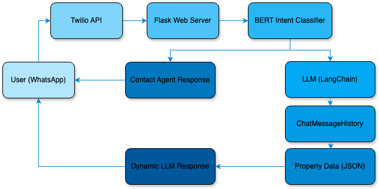

# Real Estate Chatbot with LLM and BERT Intent Classifier

## Overview

This project is a sophisticated chatbot designed to interact with users via WhatsApp, providing property information and handling user inquiries for a real estate business. The chatbot uses a combination of a BERT-based intent classifier and a Language Learning Model (LLM) to offer accurate and contextually aware responses.

For those interested in a deeper dive into the technical details and development process of this project, a series of blog posts is available on [Medium](www.medium.com).

## Features

- **WhatsApp Integration**: Utilizes Twilio API to handle messaging through WhatsApp.
- **Intent Classification**: Implements a BERT-based model to classify user intents, such as contacting an agent or requesting property details.
- **Context Management**: Uses LangChain's `ChatMessageHistory` to keep track of conversation context, ensuring accurate and relevant responses.
- **Dynamic and Predefined Responses**: Based on the user's intent, the bot can provide dynamic LLM-generated responses or predefined messages.
- **Property Data Integration**: Retrieves and processes property details stored in JSON format, allowing the bot to deliver detailed information on demand.

## Architecture



The architecture includes:

- **User (WhatsApp)**: The entry point where users interact with the chatbot.
- **Twilio API**: Facilitates the connection between WhatsApp and the Flask web server.
- **Flask Web Server**: The backend server handling incoming messages and processing responses.
- **BERT Intent Classifier**: Classifies the user's message into intents such as "contact agent" or "other."
- **LLM (LangChain)**: Generates responses based on the conversation context.
- **ChatMessageHistory**: Maintains the conversation history to provide context-aware responses.
- **Property Data (JSON)**: The dataset containing detailed property information.

## Setup and Installation

### Prerequisites

- Python 3.7+
- Twilio Account
- OpenAI API Key

### Installation

1. Clone the repository:
   ```bash
   git clone https://github.com/juancarlos285/chatbot.git
   cd chatbot
2. Create and activate a virtual environment:
   ```bash
   python -m venv env
   source env/bin/activate
3. Install the required dependencies:
   ```bash
   pip install -r requirements.txt
   ```
4. Set up your environment variables:
   ```bash
   export OPENAI_API_KEY='your-openai-api-key'
   export TWILIO_ACCOUNT_SID='your-twilio-account-sid'
   export TWILIO_AUTH_TOKEN='your-twilio-auth-token'
   ```

### Running the Application

1. Run the Flask web server:
```bash
python run.py
```
3. Expose your local server to the internet:
   Use a service like Ngrok or Tailscale to create a public URL that routes to your local server.
   Update your Twilio webhook settings to point to the public URL generated.
4. Interact with the chatbot via WhatsApp:
   Send a message to the WhatsApp number connected to your Twilio account.
   The chatbot will respond based on the message content and intent.

### Usage
- **Property Information:** Users can request details about properties by mentioning specific locations or features. For example, "How much is the house on Main Street?" will prompt the chatbot to provide relevant property details.

- **Contact Agent:** If a user expresses intent to contact a real estate agent or schedule a viewing, the chatbot will recognize this intent and provide a specific response, such as "En unos minutos, el agente inmobiliario se pondrá en contacto contigo. Gracias por contactar a Asesores Inmobiliarios."

### Contributing
We welcome contributions to improve this chatbot. Please follow these steps:

1. Fork the repository.

2. Create a new branch:
```bash
   git checkout -b feature-name
   ```
3. Make your changes.

4. Commit your changes:
   ```bash
   git commit -m "Description of changes"
   ```
5. Push to your branch:
   ```
   bash
   Copy code
   git push origin feature-name
   ```
6. Create a Pull Request for review.

### Contact
For any inquiries, feel free to reach out via email: jcacosta285@gmail.com   
