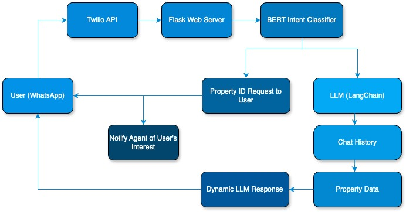

# Real Estate Chatbot with LLM and BERT Intent Classifier

## Overview

This project is a sophisticated chatbot designed to interact with users via WhatsApp, providing property information and handling user inquiries for a Latin American real estate company. The chatbot operates in Spanish, catering to the target audience's language needs. It uses a combination of a BERT-based intent classifier and a Language Learning Model (LLM) to offer accurate and contextually aware responses.

WhatsApp is the preferred platform for this project because it is the most widely used communication app in Latin America, making it an ideal choice for reaching a broad audience.

For those interested in a deeper dive into the technical details and development process of this project, a series of blog posts is available on [Medium](www.medium.com).

## Features

- **WhatsApp Integration:** Uses the Twilio API to integrate WhatsApp messaging for direct communication with users.
- **Flask Backend:** The application is built on a Flask server, which manages interactions between the user and the chatbot.
- **BERT Intent Classification:** A fine-tuned BERT model is used to classify user messages into different intents, such as inquiring about properties or contacting an agent.
- **Context Management:** The chatbot keeps track of user interactions, allowing for multi-step conversations where users can inquire about multiple properties and contact agents.
- **Vector Database:** Property information is stored in a vector database and embedded for efficient retrieval. This allows the chatbot to quickly search and retrieve relevant property details based on user input.
- **LangChain Integration:** LangChain is used to handle the language model's interaction, generating dynamic responses based on user queries.

## Architecture



The architecture includes:

- **User (WhatsApp):** The entry point where users interact with the chatbot.
- **Twilio API:** Facilitates the connection between WhatsApp and the Flask web server.
- **Flask Web Server:** The backend server handling incoming messages and processing responses.
- **BERT Intent Classifier:** Classifies the user's message into intents such as "contact agent" or "other."
- **LLM (LangChain):** Handles interactions between the language model and the property database, ensuring accurate and context-aware responses.
- **ChatMessageHistory:** Maintains the conversation history to provide context-aware responses.
- **Property Data (JSON):** Property data and agent information are stored in JSON format for easy access and manipulation.

## Setup and Installation

### Prerequisites

- Python 3.7+
- Twilio Account
- OpenAI API Key

### Installation

1. Clone the repository:
   ```bash
   git clone https://github.com/juancarlos285/chatbot.git
   cd chatbot
2. Create and activate a virtual environment:
   ```bash
   python -m venv env
   source env/bin/activate
3. Install the required dependencies:
   ```bash
   pip install -r requirements.txt
   ```
4. Set up your environment variables:
   ```bash
   export OPENAI_API_KEY='your-openai-api-key'
   export TWILIO_ACCOUNT_SID='your-twilio-account-sid'
   export TWILIO_AUTH_TOKEN='your-twilio-auth-token'
   export TWILIO_SANDBOX_NUMBER='your-twilio-whatsapp-sandbox-number'
   ```
### Setting Up Large Files
Due to size limitations, the data folder and the results folder (containing the fine-tuned model) are not included in this repository. To set up these files locally, please follow the steps below:

**Step 1: Download the Required Files**
1. Download the data folder:
   - [Click here to download the data folder from Google Drive](https://drive.google.com/drive/folders/13Ctkh9Vl9TYa0rUBsKzv1o1eQsAQD67T?usp=drive_link)
2. Download the results folder (fine-tuned model):
   - [Click here to download the results folder from Google Drive](https://drive.google.com/drive/folders/1uL9potBo_IpR-A7dUTv6mccYfmJ5xc3V?usp=drive_link)

**Step 2: Place the Files in the Project Directory**
1. After downloading, place the folders in the root directory of the project.
   
### Twilio Sandbox Setup (For Testing)
1. Create a Twilio Sandbox for WhatsApp:
   - Log in to your Twilio account and navigate to the [Twilio Sandbox for WhatsApp](https://www.twilio.com/docs/whatsapp/sandbox).
   - Follow the instructions to activate the sandbox. Twilio will provide you with a phone number and a unique code for joining the sandbox.

2. Add the Twilio Sandbox Phone Number:
   - Update your environment variables or the configuration file with the Twilio sandbox phone number:
   ```bash
   export TWILIO_SANDBOX_NUMBER='whatsapp:+your-sandbox-number'
   ```
3. Join the Sandbox:
   - To start testing, send a WhatsApp message containing the unique code provided by Twilio to the sandbox phone number. This will link your WhatsApp account to the sandbox.

4. Interact with the Chatbot:
   - Once you've joined the sandbox, you can send messages to the sandbox number from your WhatsApp account. The chatbot will respond based on the message content and intent.

## Running the Application

1. Run the Flask web server:
```bash
python run.py
```
3. Expose your local server to the internet:
   Use a service like Ngrok or Tailscale to create a public URL that routes to your local server.
   Update your Twilio webhook settings to point to the public URL generated.
4. Interact with the chatbot via WhatsApp:
   Send a message to the WhatsApp number connected to your Twilio account.
   The chatbot will respond based on the message content and intent.

## Usage
- **Property Information:** Users can request details about properties by mentioning specific locations or features. For example, "How much is the house on Main Street?" will prompt the chatbot to provide relevant property details.

- **Contact Agent:** If a user expresses intent to contact a real estate agent or schedule a viewing, the chatbot will recognize this intent and provide a specific response, such as "In a moment, an agent will be in touch with you. Thank you for contacting us."

## Contributing
We welcome contributions to improve this chatbot. Please follow these steps:

1. Fork the repository.

2. Create a new branch:
```bash
   git checkout -b feature-name
   ```
3. Make your changes.

4. Commit your changes:
   ```bash
   git commit -m "Description of changes"
   ```
5. Push to your branch:
   ```bash
   git push origin feature-name
   ```
6. Create a Pull Request for review.

## Contact
For any inquiries, feel free to reach out via email: jcacosta285@gmail.com   
